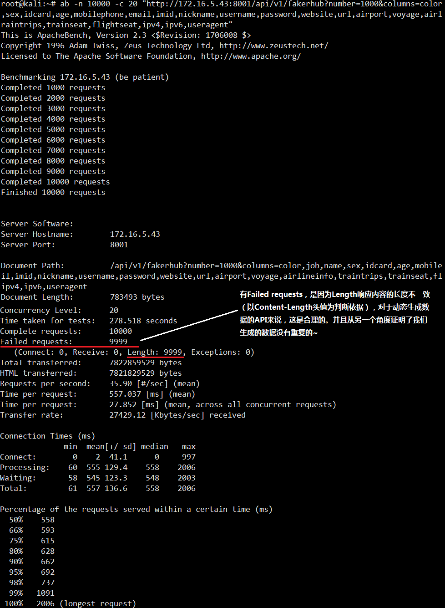

# FakerHub
伪造测试数据的API服务

## 结合中国国情，伪造测试数据

伪造测试数据的库有很多，Python有大名鼎鼎的[faker](https://github.com/joke2k/faker)，Golang有[gofakeit](https://github.com/brianvoe/gofakeit)，
但是这些库的中文本地化都不够完善，工作中用的数据大部分是中文，因此想做一次本地化，方便团队开展测试，不再为测试数据发愁。

美中不足的是，faker和gofakeit都只是一个第三方库，不是一个服务，需要自己写代码来调用才能达到测试效果，而且安装部署起来依赖包比较多（个人目前研发生产环境均为内网，无法连接互联网），部署实在是不方便。

于是我就想如果我做成一个性能比较好的服务，提供API，让大家都能通过HTTP请求灵活获取所需的数据，岂不美哉！而且这个服务的应用面应该是很广的，可以用于单元测试、功能测试、性能测试、可靠性测试，而且可以解决研发生产环境没有持续的测试数据的痛点！

为什么没有用Python？考虑到几个方面：
* Python的部署比较复杂，Golang只要编译好提供二进制文件就好，比较方便（经常出差去客户现场，部署开发环境就是噩梦）。
* Golang的并发性能比较好（虽然Python也有Tornado框架）。

## 目前已经支持的数据类型

| 序号   |     参数      | 说明                                    |
| :--- | :---------: | ------------------------------------- |
| 1    |    color    | 颜色                                    |
| 2    |     job     | 职业                                    |
| 3    |    name     | 中文名字                                  |
| 4    |     sex     | 性别                                    |
| 5    |   address   | 地址信息（地区编号、邮编、固话区号、省市信息、社区名称、社区简称、经纬度） |
| 6    |   idcard    | 大陆居民身份证号码                             |
| 7    |     age     | 年龄                                    |
| 8    | mobilephone | 移动电话号码                                |
| 9    |    email    | 电子邮箱                                  |
| 10   |    imid     | IM类型的用户ID                             |
| 11   |  nickname   | 用户昵称                                  |
| 12   |  username   | 用户名                                   |
| 13   |  password   | 用户密码                                  |
| 14   |   website   | 网站地址                                  |
| 15   |     url     | 网址URL（随机http或https）                   |
| 16   |   airport   | 国内机场信息（IATA编码、城市名称、ICAO编码、机场名称、城市拼音）  |
| 17   |   voyage    | 国内航班号                                 |
| 18   | airlineinfo | 国内航空公司信息（代号、中文名称）                     |
| 19   | traintrips  | 火车班次（覆盖高铁、动车、特快、普快、城际、旅游专线）           |
| 20   |  trainseat  | 火车座号                                  |
| 22   | flightseat  | 飞机座号                                  |
| 23   |    ipv4     | ipv4的点分型IP地址                          |
| 24   |    ipv6     | ipv6的点分型IP地址                          |
| 25   |     mac     | mac地址（随机大小写，分隔符）                |
| 26   |  useragent  | 浏览器请求头                                |
| 27   |    imsi     | IMSI（目前只支持国内460开头的）              |
| 28   |    imei     | IMEI（目前支持中国、英国、美国）             |
| 29   |    meid     | MEID（随机大小写）                         |
| 30   |  deviceid   | DEVICEID（设备编号）                         |
| 31   |  telphone   | 固定电话（暂时只支持国内号码）                 |
| 32   |  citycode   | 国内长途区号                                 |
| 33   |specialphone | 特殊电话号码（比如10086、110）                |
| 34   | capturetime | 当前时间绝对秒（10位数字）                      |
| 35   |   date      | 当前时间，数据库日期格式{YYYYMMDD,hh:mm:ss}    |

## 使用效果

## [小试一下](http://172.16.5.43:8001/api/v1/fakerhub?number=1&columns=color,job,name,sex,address,idcard,age,mobilephone,email,imid,nickname,username,password,website,url,airport,voyage,airlineinfo,traintrips,trainseat,flightseat,ipv4,ipv6,useragent,mac,imsi,imei,meid,deviceid,telphone,citycode,specialphone,capturetime,date)

## 性能评估

### FakerHub所在服务器硬件情况

| 硬件   | 详情                                       |
| ---- | ---------------------------------------- |
| CPU  | 4 核 Intel(R) Xeon(R) CPU E5-2660 v3 @ 2.60GHz |
| MEM  | 8G                                       |
| NET  | 10000Mb/s                                |

### 使用ab对接口进行压测

| 参数项  | 参数值                          |
| ---- | ---------------------------- |
| 请求条件 | 每条数据返回24个字段，一次GET请求返回1000条数据 |
| 请求次数 | 10000                        |
| 并发   | 20                           |

  

  ab测试结果解读：

  - 模拟构造API请求随机生成10000000（1000 x 10000）条数据，耗时278.518秒。
  - 生成数据总量约7.28 GB（7821829529 bytes）
  - 吞吐率（Requests per second）： 35.90 
  - 用户平均请求等待时间（Time per request）：557.037 ms
  - 服务器平均请求处理时间（Time per request，across all concurrent requests）：27.852 ms
  - 90%的请求耗时低于662 ms

### 服务器性能表现

  FakerHub运行对CPU的资源消耗比较大，下面三个图为ab压测五分钟的硬件使用率

  - CPU

    

    - MEM

      

    - NET

      
	
	
### 环境依赖
- 开发环境：go1.9以上
- 运行环境：直接使用发布的二进制文件即可
	
## 鸣谢
- [gofakeit](https://github.com/brianvoe/gofakeit) Random fake data generator written in go.
- [faker](https://github.com/joke2k/faker) Faker is a Python package that generates fake data for you.
